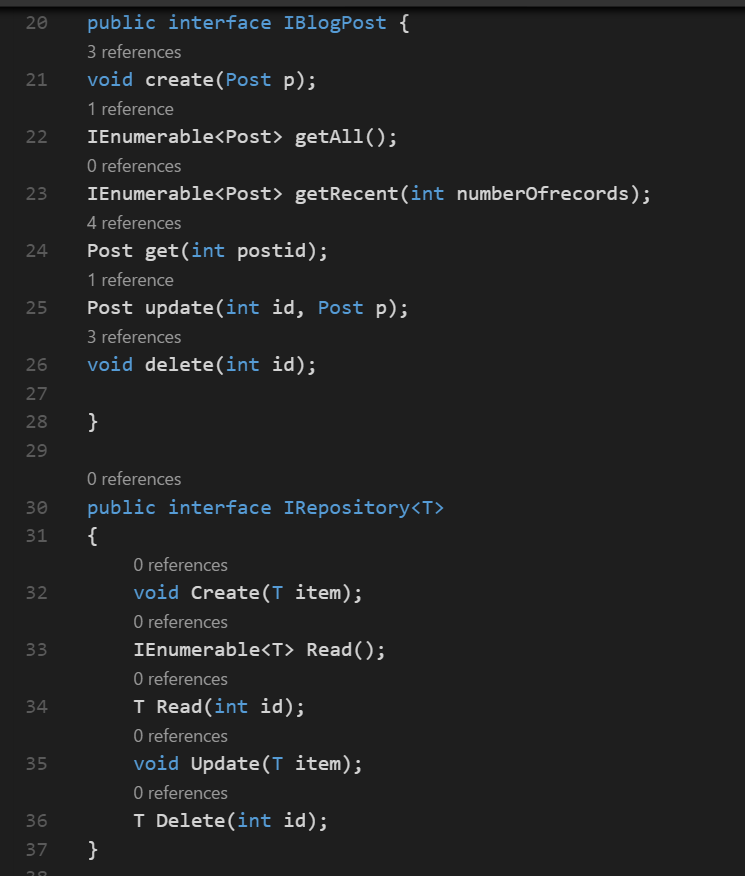
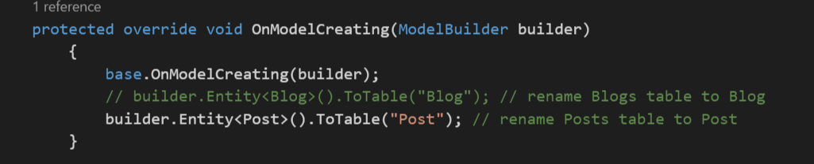
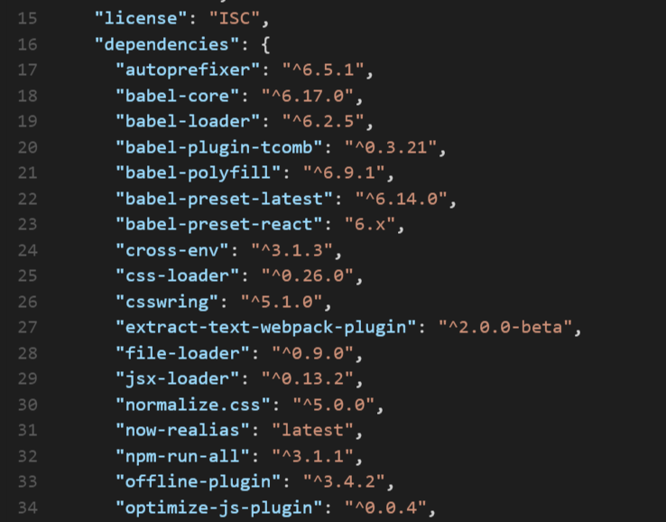
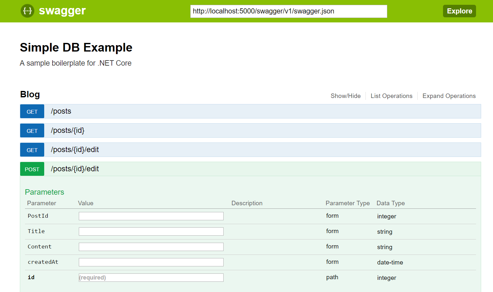

#Blog Post 
Link to live page: 

###Overveiw
- A dotnet core web application built as a holiday themed blog with full C.R.U.D funtionality.
- Users may post up new blog posts, edit existing posts, veiw the most recent posts, and delete posts.
- The application uses a MVC format with an in memory database. 
- Built on the .NET Core Boilerplate which you can learn more about below.

###Challenges Faced and Solutions Used: 
The main problem I encountered due to this being one of the first MVC applications I built was using dependency injection to link the models and controllers. To accomplish this, I used a repository interface to provide the CRUD functionality to the controllers and bound the models in the DB.cs file using a override function. 

The other major issue I faced was in the deployment of the server to now.sh after the application was complete. This required troubleshooting the package.JSON file and checking versioning of the dependencies. The problem turned out to be a versioning error with npm for dot.net core. Since dot.net core is the open stack side of ASP.NET, the version of npm in the boilerplate turned out to be for Linux and not compatible with a Windows environment. This was pretty easy to fix once I was able to identify the issue. 

###Error Handling and Troubleshooting:
Much of the error handling for this program was done with the use of Swagger.ui, a nuget package that provides an interface for testing CRUD functions and model binding. It allows initiating a Get or Post request sending up or receiving JSON from the backend of your application. 

###MVP(Minimum Viable Product) and Stretch Goals: 
###MVP
- Ability to visit the site and view a message board of blogposts. 
- Ability to create new posts as well as delete or edit existing posts. 

###Stretch Goals
- All posts will be timestamped and displayed in order from the most recent. 
- Add styling elements. 

###Contribution we'd like to be added:
- Add user logins.
- Create multiple chat rooms to post different blogs. 

# .NET Core Boilerplate

> note: alpha stages

# How to use

1. optional: fork to your own account on GitHub
-  clone to your machine
- `npm install -g now yarn`
- `yarn`
- `dotnet restore`
- if using Entity Framework:

    - modify Models/*.cs to create your csharp Models for Entity Framework Core; add any seeded data to the `Seeder` class
    - `dotnet ef migrations add init` - create the initial migrations for the database seeding
    - `dotnet ef database update` - write the migrations to the database
    - if at any point you change a model, rerun these steps above

- `npm start` - runs and watch the files for changes. Underneath, this runs `dotnet watch run` and `npm watch`.
- if at any point you install a package through NuGet or change the project.json file - hit Ctrl+C and run step 3 again.
- open `http://localhost:5000` to view local server

# To deploy

To https://now.sh:

- from project folder: `now --docker`
- open the url provided (`dotnetcore-boilerplate-XXXXXXXXXXXX.now.sh`); when the installation is done the browser will be redirected to your new server
- to setup a custom URL: `now alias dotnetcore-boilerplate-XXXXXXXXXXXX.now.sh YOURAPPNAME.now.sh`

To https://heroku.com

- install the heroku CLI (https://devcenter.heroku.com/articles/heroku-command-line)
- (update and commit all your local git files)
- `heroku create --buildpack http://github.com/noliar/dotnet-buildpack.git`
- `git push heroku master`
- `heroku open`

# Support

1. Please submit issues on GitHub with proper taggings / labels.
2. Reach out to [@matthiasak](https://twitter.com/matthiasak).
